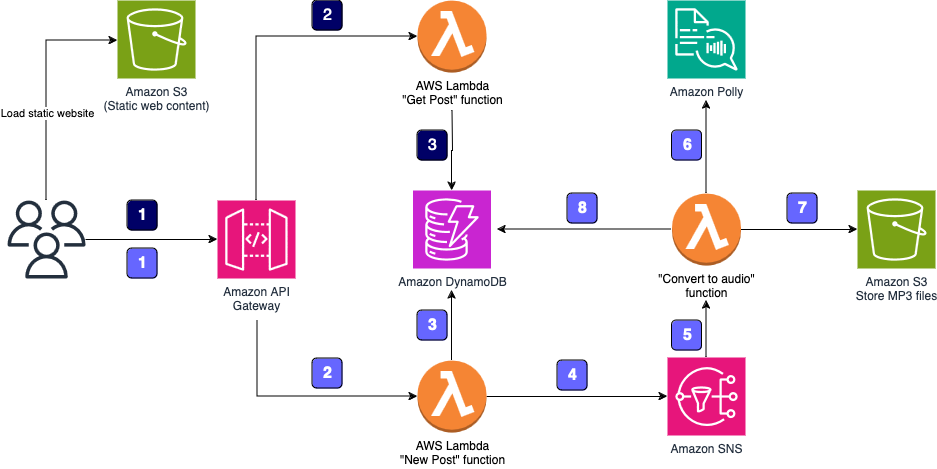
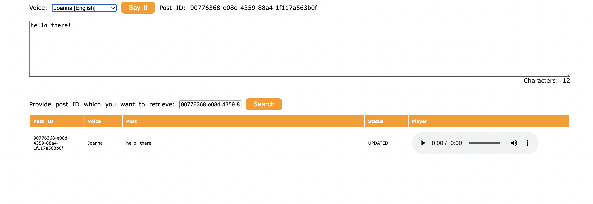

# Serverless Text-to-Speech Application

## Overview

This application provides two key functionalities:

1. **New Post Submission**: Allows users to submit a post that will be converted into an MP3 file.
2. **Post Retrieval**: Allows users to retrieve information about a post, including a link to the MP3 file stored in an Amazon S3 bucket.

Both functionalities are exposed as RESTful web services through Amazon API Gateway.

## Architecture Diagram

## Architecture

### New Post Submission

1. **Webpage Submission**:

   - A static webpage hosted on Amazon S3 sends the post information to a RESTful web service exposed by Amazon API Gateway.

2. **AWS Lambda Trigger**:

   - Amazon API Gateway triggers an AWS Lambda function called **New Post**. This function initializes the process of converting the post into an MP3 file.

3. **DynamoDB Storage**:

   - The Lambda function stores the post information in an Amazon DynamoDB table, which serves as the central storage for all post data.

4. **Asynchronous Processing**:

   - To handle the processing asynchronously, the **New Post** Lambda function publishes a message to an Amazon SNS topic, decoupling the receipt of post information from the audio conversion process.

5. **Audio Conversion**:

   - Another Lambda function, called **Convert to Audio**, is subscribed to the SNS topic. It is triggered whenever a new message is published (indicating a new post to be converted).
   - The **Convert to Audio** Lambda function uses Amazon Polly to convert the text of the post into an MP3 file in the specified language.

6. **S3 Storage**:
   - The generated MP3 file is saved in a designated S3 bucket.
   - The post information in the DynamoDB table is updated with the URL of the MP3 file stored in the S3 bucket.

### Post Retrieval

1. **Webpage Request**:

   - A static webpage hosted on Amazon S3 sends a request to a RESTful web service exposed by Amazon API Gateway to retrieve post information.

2. **AWS Lambda Trigger**:

   - Amazon API Gateway triggers the **Get Post** Lambda function, which contains the logic for retrieving post data.

3. **Data Retrieval**:

   - The **Get Post** Lambda function fetches the post information, including the URL of the MP3 file stored in the S3 bucket, from the DynamoDB table.

4. **Response**:
   - The Lambda function returns the post information, including the MP3 file link, to the static webpage.

## Deployment

1. **Amazon S3**:

   - The static webpage for both submitting and retrieving posts is hosted on Amazon S3.

2. **Amazon API Gateway**:

   - The RESTful web services for submitting and retrieving posts are deployed using Amazon API Gateway.

3. **AWS Lambda Functions**:

   - **New Post**: Initializes the process for generating MP3 files.
   - **Convert to Audio**: Converts the text to an MP3 file using Amazon Polly and stores it in Amazon S3.
   - **Get Post**: Retrieves post information from DynamoDB and returns it to the client.

4. **Amazon DynamoDB**:

   - Stores information about all posts, including their text, status, and the URL of the MP3 file.

5. **Amazon SNS**:

   - Used for decoupling the process of receiving new posts and converting them into audio files.

6. **Amazon Polly**:
   - Used by the **Convert to Audio** Lambda function to convert text to speech and generate the MP3 file.

## Usage

### Submitting a Post

1. Open the static webpage hosted on Amazon S3.
2. Enter the text of the post and select the desired voice.
3. Submit the post. The webpage will send the post information to the API Gateway, triggering the process to convert the post into an MP3 file.

### Retrieving a Post

1. Open the static webpage hosted on Amazon S3.
2. Enter the post ID to retrieve information about a specific post.
3. The webpage will request the post information from the API Gateway, and the retrieved data, including the MP3 file link, will be displayed.

## Additional Information

This application was built following a AWS workshop that originally provided a Python implementation. The code has been converted to Node.js using TypeScript.

## Project Screenshot

